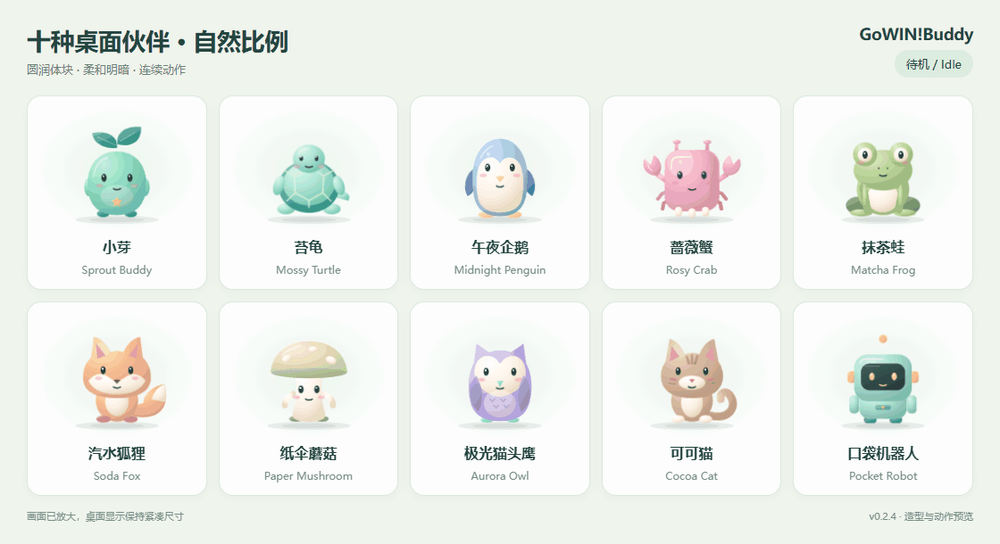

<b>English</b> · <a href="README.zh-CN.md">简体中文</a> · <a href="https://github.com/FanxingMeng1999/GoWIN-Buddy/releases/latest">Download for Windows</a> · <a href="docs/user-guide.en.md">User guide</a>

# GoWIN!Buddy

**A little desktop companion that makes your day feel like an adventure.**

Sprout Buddy lives at the edge of your screen. Hover to capture a task, double-click to see your day, and turn small progress into XP, stars and milestones in a local RPG dashboard. Built for study, work and personal projects.

The public edition includes ten original mascot characters, ten bundled character themes, locally served fonts, an empty first-run profile and a standalone Windows installer. Core task and RPG use works without a cloud account.

## Meet your mascots

Meet ten naturally proportioned companions: Sprout Buddy, Mossy Turtle, Midnight Penguin, Matcha Frog, Rosy Crab, Soda Fox, Paper Mushroom, Aurora Owl, Cocoa Cat and Pocket Robot. Soft surface shading and keyframed idle, work, happy and rest motions give each rounded body a lively, dimensional look. Their SVG geometry scales uniformly, preserving compact size without flattening the artwork. Movement stays visible at desktop size, with a short crossfade between states.

[Rosy Crab motion close-up](docs/media/rosy-crab-preview-v3.gif) · [Static character lineup](docs/media/mascot-gallery.png)

Choose a character and color theme from the pet’s appearance menu.

## See it in action

*Captured from the public Windows build with a separate demonstration profile. Every task shown is fictional.*

| Quick tasks beside your pet | Your local adventure dashboard |
| --- | --- |
|  |  |

## What you can do

| Feature | Everyday use |
| --- | --- |
| Animated desktop pet | Drag, resize, sleep, mute, switch themes or use compact edge mode |
| Quick task panel | Add temporary, daily, weekly and long-term tasks; temporary tasks support deadlines |
| Work and focus records | Clock in/out beside the pet; review records and focus sessions in the dashboard |
| RPG loop | Daily/weekly quests, check-ins, XP, stars, titles, collectible looks and long-term milestones |
| Local synchronization | Changes in the pet and dashboard meet in the same local state file |
| Recovery | Atomic saves, a previous-state backup and preservation of malformed files |
| Personal dashboard | Goal countdowns, mood and reflection records, history and JSON export |
| Customization | Ten distinct mascot silhouettes and palettes, plus an editable theme template |

Completed temporary tasks can be cleared with “收起”; that cleanup itself does not grant XP. Rewards follow the dashboard's quest/check-in/milestone rules.

## Install in a minute

1. Open [Releases](https://github.com/FanxingMeng1999/GoWIN-Buddy/releases/latest) and download **GoWINBuddy-Setup-0.2.4.exe**.
2. Run the installer, choose English or Simplified Chinese and launch GoWIN!Buddy.
3. Hover over the pet, add a small task and double-click it to open the dashboard.

The release targets **Windows 10/11 x64**, installs for the current user and bundles its runtimes. **Ctrl+Alt+Q** opens and pins quick tasks. The tray menu provides themes, size, autostart and Quit. The desktop menus follow the system locale; the dashboard currently uses Chinese labels. [English button explanations](docs/user-guide.en.md#everyday-controls) are included in the guide.

The installer is unsigned. Each release includes its SHA-256 and tested-version notes. Updates use manual release downloads. Source-level macOS/Linux settings are inherited from upstream; this project's distributed installer and recorded verification target Windows.

## Your data

Normal installed state lives in %APPDATA%/gowin-buddy-pet/state/game_state.json, with preferences in gowin-prefs.json under the same profile. The dashboard listens on the local loopback interface. Export JSON to keep an independent backup; uninstalling preserves the profile.

Independent edits merge. Conflicting edits to the same field produce a visible warning and retain the dashboard cache. [The guide](docs/user-guide.en.md#data-and-recovery) explains recovery and updates. Optional agent hooks are retained in the source for developers who configure their own tools.

## Build, test and contribute

~~~powershell
git clone https://github.com/FanxingMeng1999/GoWIN-Buddy.git
cd GoWIN-Buddy
powershell -NoProfile -ExecutionPolicy Bypass -File scripts/bootstrap-local-deps.ps1
powershell -NoProfile -ExecutionPolicy Bypass -File installer/windows/build-installer.ps1
~~~

The installer is written to installer/windows/dist/. npm dependencies are locked; build tools, personal state, local logs and machine-resolved paths are excluded from Git. See [build instructions](docs/building.en.md), [verification results](docs/validation.md), [character themes](docs/themes.md) and [contributing](CONTRIBUTING.md).

## License and credits

**MIT** covers GoWIN!Buddy code, documentation and the new Sprout Buddy artwork. It permits use, modification and redistribution with the copyright/license notice retained. The desktop runtime incorporates MIT-licensed [Clawd on Desk](https://github.com/rullerzhou-afk/clawd-on-desk) code by **rullerzhou-afk**, whose notice is preserved.

This public edition replaces the upstream pet artwork and sounds with independent original assets. Their editable SVG source, generator and export manifest are included. Font Awesome and bundled runtimes retain their own licenses; see [third-party notices](THIRD_PARTY_NOTICES.md).

[Bug reports and ideas](https://github.com/FanxingMeng1999/GoWIN-Buddy/issues) · [中文宣发文案](docs/announcement.zh-CN.md) · [English announcement](docs/announcement.en.md)
