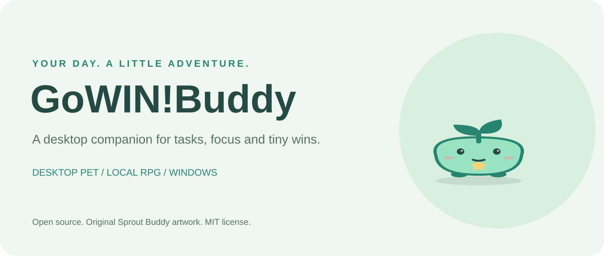
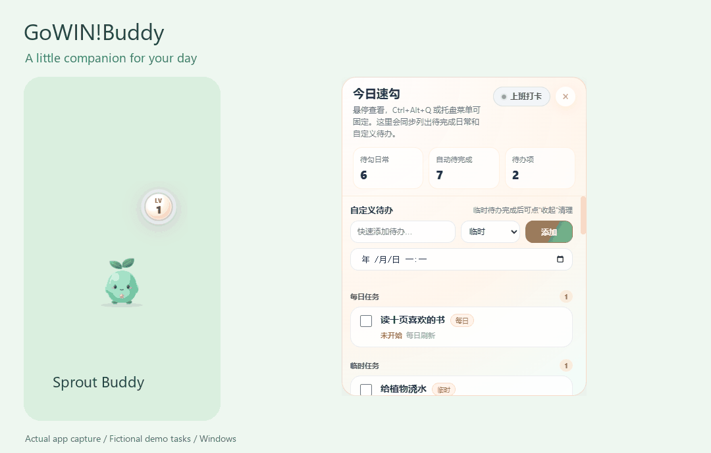
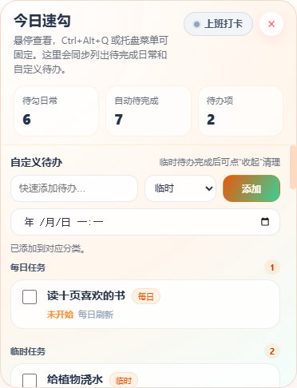

<a href="README.md">English</a> · <b>简体中文</b> · <a href="https://github.com/FanxingMeng1999/GoWIN-Buddy/releases/latest">下载 Windows 安装包</a> · <a href="docs/user-guide.zh-CN.md">使用指南</a>

# GoWIN!Buddy

**让每天的任务，成为一场小小的冒险。**

小芽 Sprout Buddy 待在屏幕边缘。鼠标移过去记一条待办，双击看看今天的进度；学习、工作和生活中的小步推进，可以在本机 RPG 仪表盘里积累经验、星尘与里程碑。

公开版提供独立制作的小芽角色、十套内置主题、本地字体、空白首启存档和独立 Windows 安装器。日常任务与 RPG 功能无需云账号。

## 实际演示

*图片与动图来自公开版 Windows 程序，使用独立演示存档；图中任务均为虚构示例。*

| 宠物旁的今日速勾 | 本机冒险仪表盘 |
| --- | --- |
|  |  |

## 功能一览

| 功能 | 可以做什么 |
| --- | --- |
| 动画桌宠 | 拖动、缩放、休眠、静音、主题切换与屏幕边缘迷你模式 |
| 今日速勾 | 添加临时、每日、每周、长期任务；临时任务可设置截止时间 |
| 工作与专注记录 | 在宠物旁上下班打卡，在仪表盘查看工作记录和专注会话 |
| RPG 成长 | 每日/每周任务、签到、经验、星尘、称号、外观收集和长期里程碑 |
| 本机双向同步 | 桌宠与仪表盘使用同一份本地存档 |
| 保存与恢复 | 原子写入、上一份有效状态备份、损坏文件留存 |
| 个人仪表盘 | 目标倒计时、心情与反思、历史记录、JSON 导出 |
| 自定义 | 十套原创小芽主题，以及可编辑的主题模板 |

已完成临时任务通过“收起”清理，这个操作本身不发放经验；奖励按仪表盘的任务、签到和里程碑规则计算。

## 安装与上手

1. 进入 [Releases](https://github.com/FanxingMeng1999/GoWIN-Buddy/releases/latest)，下载 **GoWINBuddy-Setup-0.2.1.exe**。
2. 运行安装器，选择简体中文或 English、安装位置并启动。
3. 鼠标移到宠物上，添加一个小任务；双击宠物打开仪表盘。

安装包支持 **Windows 10/11 x64**，面向当前用户安装，已包含运行时。**Ctrl+Alt+Q** 可以打开并固定速勾面板；右键或托盘菜单可切换主题、大小、开机自启和退出。桌宠菜单跟随系统语言，仪表盘当前为中文；英文指南附有按钮释义。

本次安装器未做代码签名，Release 同时提供 SHA-256 和验收记录。通过 Release 下载新安装器更新。源码保留上游 macOS/Linux 设置，当前分发与已记录验收以 Windows 为准。

## 数据保存在你自己的电脑上

安装版的状态位于 %APPDATA%/gowin-buddy-pet/state/game_state.json，偏好设置为该存档目录上一级的 gowin-prefs.json。仪表盘使用本机回环地址。可以导出 JSON 另存备份，卸载保留个人存档。

不同字段的并行修改会自动合并；同一字段冲突时会提示，并保留仪表盘本地缓存。[使用指南](docs/user-guide.zh-CN.md)说明了保存失败、备份恢复和更新步骤。源码还保留可选的编程助手 Hook，供开发者自行配置工具后使用。

## 源码构建与参与开发

~~~powershell
git clone https://github.com/FanxingMeng1999/GoWIN-Buddy.git
cd GoWIN-Buddy
powershell -NoProfile -ExecutionPolicy Bypass -File scripts/bootstrap-local-deps.ps1
powershell -NoProfile -ExecutionPolicy Bypass -File installer/windows/build-installer.ps1
~~~

安装包输出到 installer/windows/dist/。npm 版本由锁文件固定，工具运行时、个人数据、本机日志和解析后的机器路径不进入 Git。详见[中文构建指南](docs/building.zh-CN.md)、[实际验收结果](docs/validation.md)、[主题说明](docs/themes.md)和[贡献说明](CONTRIBUTING.md)。

## 开源协议与致谢

项目代码、文档和新制作的小芽素材采用 **MIT**，允许使用、修改和再分发，并要求保留版权与许可声明。桌宠运行时包含 **rullerzhou-afk** 的 [Clawd on Desk](https://github.com/rullerzhou-afk/clawd-on-desk) MIT 代码，已保留上游署名。

公开版使用独立制作的角色、图标和提示音。仓库包含可编辑 SVG、生成脚本和素材清单。Font Awesome、Electron、Node.js、Python 等保留各自许可证，见[第三方声明](THIRD_PARTY_NOTICES.md)。

[反馈问题与建议](https://github.com/FanxingMeng1999/GoWIN-Buddy/issues) · [中文宣发文案](docs/announcement.zh-CN.md) · [English announcement](docs/announcement.en.md)
